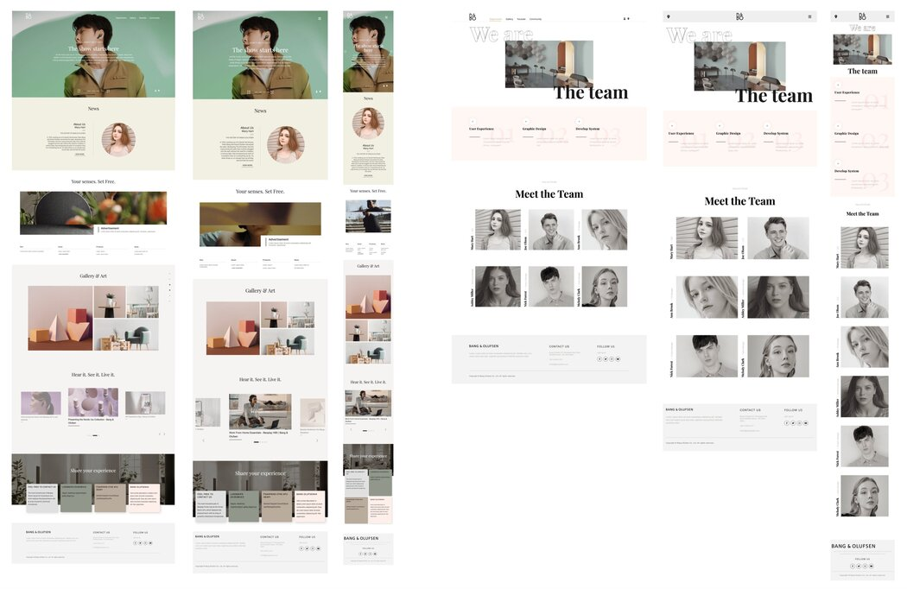

# react_portfolio

## 📋 Project

React, Redux를 학습하며 제작한 반응형 웹사이트입니다.
기업형 홈페이지에서 주로 사용되는 소개, 게시판, 미디어(유튜브, 갤러리), 지도, 회원가입으로 구성되어 있습니다.
Redux(리덕스)를 사용하여 메인 페이지와 서브페이지에 공통적으로 사용되는 데이터를 관리하고 있습니다.

## ⚒️ 사용기술

- `React`, `Redux`, `SCSS`
- `Swiper`, `Masonry`
- API : `Youtube API`, `Kakaomap API`, `Flickr API`

## 📌 전체 기능 및 특징

- 반응형 웹 : 모든 환경에서 동일하게 이용할 수 있도록 반응형 레이아웃으로 제작
- API : Youtube, Kakamap API, Flickr API를 이용하여 미디어 호출
- 스크롤 모션 : 라이브러리를 사용하지 않고, JavaScript로 만든 anime 탬플릿을 사용
- 슬라이드 모션 : Swiper 사용
- 그리드 레이아웃 & 자동정렬 : Masonry 사용
- 동적 무브먼트 구현 : framer motion 사용

## 🗂️ 페이지별 기능 및 특징

Home

Department

Gallery

Youtube

community

회원가입

Location

