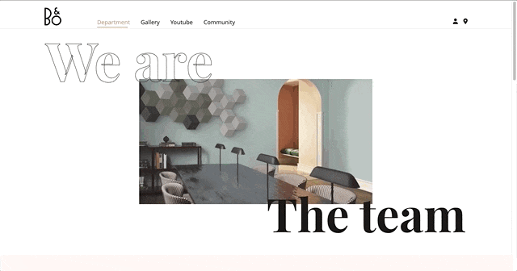
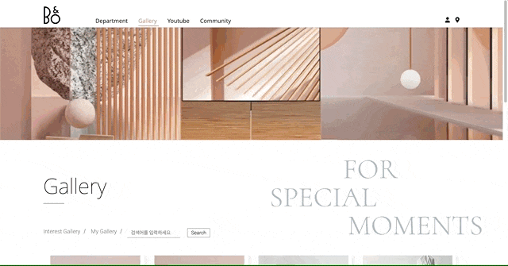
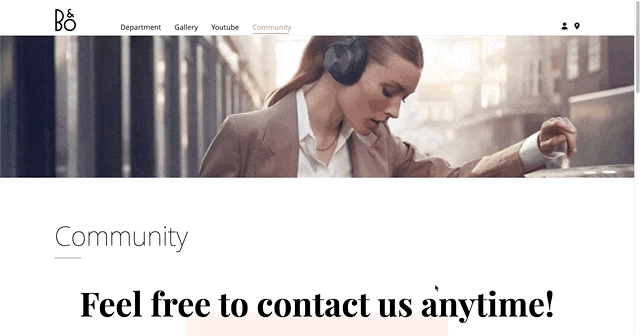
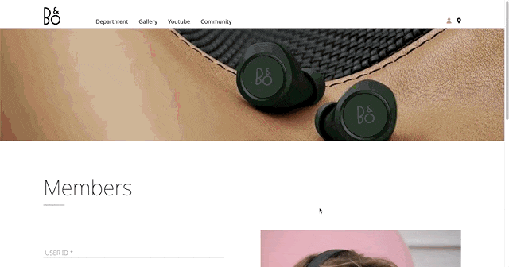
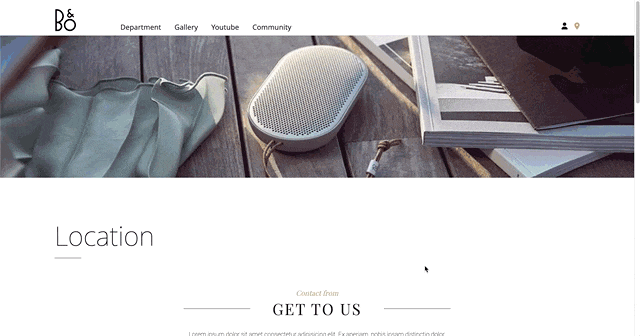

# react_portfolio

[사이트 바로가기](https://hong-kyungs.github.io/react_portfolio1/)

## 📋 Project

React, Redux를 학습하며 제작한 반응형 웹사이트입니다.
기업형 홈페이지에서 주로 사용되는 소개, 게시판, 미디어(유튜브, 갤러리), 지도, 회원가입으로 구성되어 있습니다.
Redux(리덕스)를 사용하여 메인 페이지와 서브페이지에 공통적으로 사용되는 데이터를 관리하고 있습니다.

## ⚒️ 사용기술

- `React`, `Redux`, `SCSS`
- `Masonry`
- API : `Youtube API`, `Kakaomap API`, `Flickr API`

## 📌 전체 기능 및 특징

- 반응형 웹 : 모든 환경에서 동일하게 이용할 수 있도록 반응형 레이아웃으로 제작
- API : Youtube, Kakamap API, Flickr API를 이용하여 미디어 호출
- 스크롤 모션 : 라이브러리를 사용하지 않고, JavaScript로 만든 anime 탬플릿을 사용
- 슬라이드 모션 : Swiper 사용
- 그리드 레이아웃 & 자동정렬 : Masonry 사용
- 동적 무브먼트 구현 : framer motion 사용

## 🗂️ 페이지별 기능 및 특징

Home

- 스크롤 / 슬라이드 모션
  - 라이브러리를 사용하지 않고, JavaScript로 만든 anime 탬플릿을 사용한다.
  - prev / next 버튼 클릭시 index state를 변경하여 슬라이드 모션 적용한다.
  - section별 offsetTop값을 구하여 스크롤 효과 적용한다. 버튼 클릭시 해당 index번째의 section으로 이동하고, 스크롤이 해당 section의 offsetTop값에 도달하면 버튼을 활성화한다.
- parallax scrolling
  - 스크롤링(scrolling)으로 이동을 할때 배경이 바뀌도록 한다.

Department

- 트랜지션, 스크롤링, 마우스 호버 효과

Gallery

- Flickr : Flickr API를 사용하여 이미지를 저장하고 공유한다.
  - 내 앨범, 최신 인기있는 사진 목록, 원하는 이미지 검색이 가능하다.
- Masonry : 그리드 레이아웃 라이브러리를 사용하여, 이미지를 효과적으로 배치한다
  - 가로 사이즈는 고정되어있고 세로사이즈가 유동적으로 채워진다.

Youtube

- Youtube API를 이용하여 미디어 호출
- Youtube에 만들어둔 playlist를 불러오고, 동영상 정보를 추출하여 title, thumbnail, description에 반영한다.
- 특정 영상 클릭시 iframe요소로 동영상을 재생한다.
- 스크롤, 마우스 호버 효과

Community

- CRUD 게시판
  - Create, Read, Update, Delete - 게시글 추가, 저장, 수정, 삭제가 가능하다.

회원가입

- 회원가입 조건
  - ID : 5글자 이상
  - PASSWORD : 5글자 이상 (숫자, 영문자, 특수문자 포함)
  - PASSWORD 확인
  - EMAIL : 이메일 주소 형식을 충족해야 한다.
  - Check box
  - COMMENT : 20글자 이상
- 회원가입 조건에 맞지 않게 작성시 - 해당항목별로 에러메세지 생성한다.
- 회원가입 조건에 올바르게 작성시 - 회원가입 성공 alert 띄우고, 홈화면으로 이동한다.

Location

- Kakaomap API를 이용하여 지도 호출
- 지도 생성, 커스텀 마커 적용

